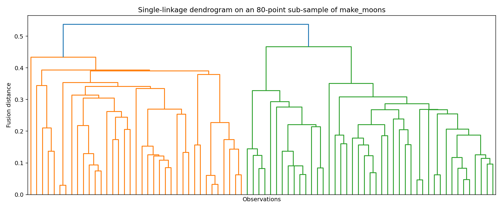
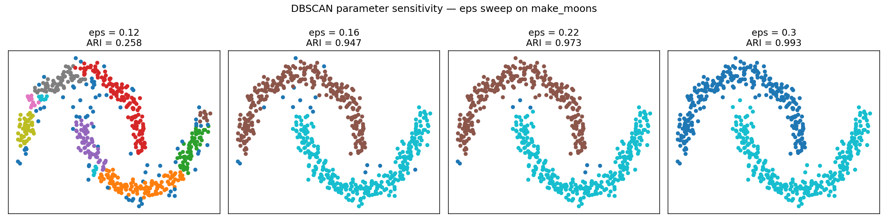
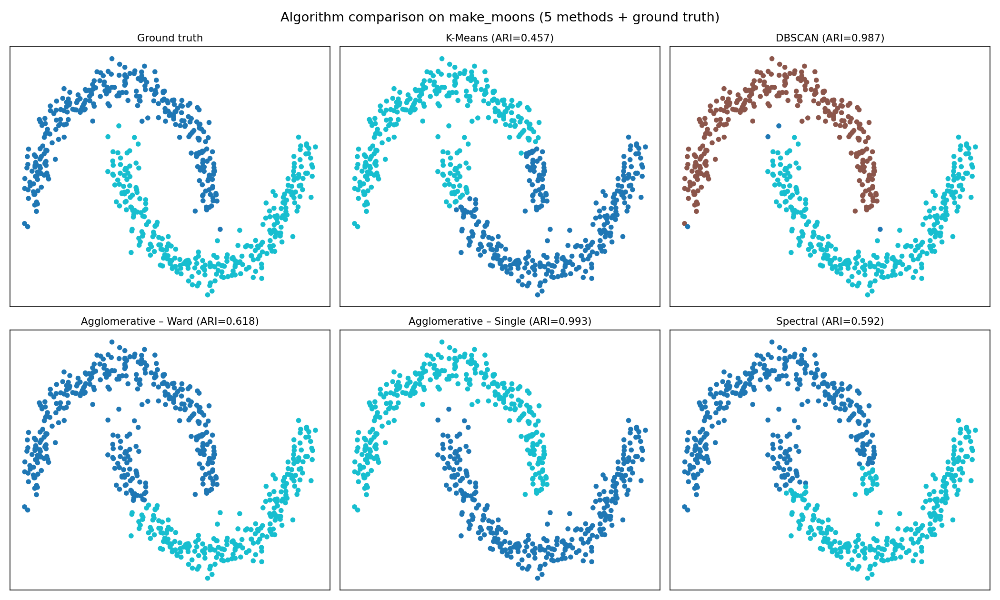

# Advanced Clustering — A Comparative Study

> A side-by-side benchmark of **K-Means, DBSCAN, Hierarchical (Agglomerative)**, and **Spectral Clustering** on three synthetic datasets that each break a different assumption — curved shapes, concentric structure, and noisy outliers.

The goal isn't "which algorithm wins." It's to show *when* and *why* each one wins or fails, with the diagnostics that let you decide responsibly: ARI, silhouette, cluster sizes, noise ratio, dendrograms, k-distance plots, and parameter-sensitivity studies.

---

## Why this project

Most introductions to clustering stop at K-Means and one neat dataset. Real data is messy: shapes aren't blobs, outliers exist, and the number of clusters isn't given. This notebook is a structured tour of the four most useful clustering families, with one shared evaluation protocol so the comparison is honest.

---

## Benchmarks

| Dataset | Why it's interesting |
|---|---|
| `make_moons` (primary) | Two interlocking curved clusters — fatal for K-Means, friendly to DBSCAN/Spectral |
| `make_circles` | Concentric rings — only methods that respect local connectivity solve it |
| `make_blobs` + 40 injected outliers | Tests robustness to noise — DBSCAN flags outliers as `-1`, others force them into clusters |

All features are standardized with `StandardScaler` before clustering.

---

## Algorithms compared

- **K-Means** — fast, intuitive, but assumes convex isotropic clusters
- **DBSCAN** — density-based, detects arbitrary shapes, marks outliers as noise (`label = -1`)
- **Agglomerative (hierarchical)** — bottom-up fusion; compared with both `ward` and `single` linkage
- **Spectral Clustering** — graph-based embedding, then K-Means in the new space

---

## Evaluation protocol

A single `evaluate_clustering()` helper produces, for every run:

- `n_clusters` actually found
- `noise_ratio` (DBSCAN only)
- **ARI** (Adjusted Rand Index) vs. ground-truth labels — external validity
- **Silhouette** with safe handling of noise points and singleton clusters — internal validity
- Cluster size distribution

Plus three diagnostics:

- **Dendrogram** (single-linkage on a sub-sample) to read the fusion structure

  

- **k-distance plot** — the `min_samples`-th nearest-neighbor distance, sorted, to pick `eps` for DBSCAN by locating the "knee"
- **Parameter sensitivity sweep** — DBSCAN with `eps ∈ {0.12, 0.16, 0.22, 0.30}` to show how brittle the result is to that one knob

  

---

## Results



### Primary — `make_moons` (ranked by ARI)

| Algorithm | n_clusters | Noise | ARI ↑ | Silhouette |
|---|---:|---:|---:|---:|
| Agglomerative (single) | 2 | 0.0% | **0.993** | 0.385 |
| DBSCAN (eps=0.25, min_samples=6) | 2 | 0.7% | **0.987** | 0.390 |
| Agglomerative (ward) | 2 | 0.0% | 0.618 | 0.456 |
| Spectral (kNN, k=12) | 2 | 0.0% | 0.592 | 0.481 |
| K-Means | 2 | 0.0% | 0.457 | 0.492 |

**Key insight:** the highest silhouette belongs to K-Means, but its ARI is the worst. Silhouette rewards compact, well-separated *blobs* — it actively penalizes the correct, curved labeling. **Internal metrics are not a substitute for external truth when the geometry is non-convex.**

### Secondary — `make_circles`

| Algorithm | ARI | Verdict |
|---|---:|---|
| Spectral | **1.000** | Perfect — exactly what spectral methods are built for |
| DBSCAN | 0.605 | Density gaps between rings are too thin |
| K-Means | ≈ 0 | Splits the plane diagonally — fails completely |

### Secondary — `blobs + outliers`

| Algorithm | Noise % | ARI |
|---|---:|---:|
| **DBSCAN** | 19.8% | **0.419** — correctly flagged outliers as `-1` |
| Agglomerative (ward) | 0% | 0.392 |
| K-Means | 0% | 0.338 |

DBSCAN's advantage is *qualitative*: only it recognizes that some points don't belong anywhere. The other methods absorb every outlier into a "real" cluster.

---

## When to reach for each method

**DBSCAN** — irregular shapes, no fixed `k`, want explicit outlier detection.
*Trade-off:* very sensitive to `eps` and `min_samples`.

**Hierarchical** — you want a multi-level structure and an interpretable dendrogram.
*Trade-off:* linkage choice matters enormously; `O(n²)` memory cost.

**Spectral** — non-convex structure where local neighborhoods matter more than global geometry.
*Trade-off:* the affinity graph must be chosen well; heavier than K-Means.

**K-Means** — fast baseline, low-dim isotropic clusters, when you genuinely have `k` ahead of time.
*Trade-off:* it will always "succeed" — even when the answer is wrong.

---

## The core idea

> It is not enough to say *"algorithm X did better"*.
> A defensible clustering result shows:
>
> 1. The data and the labeling, side by side.
> 2. An external metric (when ground truth is available).
> 3. An internal metric — interpreted critically, not trusted blindly.
> 4. Cluster sizes and noise.
> 5. Sensitivity to parameters.

That's the discipline the notebook tries to embody.

---

## Tech stack

- Python 3.11+
- `scikit-learn` — clustering, metrics, datasets, preprocessing
- `scipy.cluster.hierarchy` — `linkage` + `dendrogram`
- `numpy`, `pandas`, `matplotlib`

---

## Run it

```bash
pip install numpy pandas matplotlib scikit-learn scipy jupyter
jupyter notebook "cod ONIA.ipynb"
```

Reproducibility: `RANDOM_STATE = 42` across every algorithm and data generator.

---

## Files

- `cod ONIA.ipynb` — the full study (39 cells, ~20 figures)
- `Clustering avansat.pdf` — accompanying theory write-up (see References)
- `generate_plots.py` — regenerates every figure in `images/` from scratch
- `images/` — the figures embedded in this README

---

## References

The accompanying PDF (`Clustering avansat.pdf`) was sourced from the **MLCompete / Olimpiada AI** learning platform:

- [Clustering Avansat — Roadmap entry on platform.olimpiada-ai.ro](https://platform.olimpiada-ai.ro/en/roadmap/clustering-avansat) — the original theory write-up that motivated this study.

All implementation, benchmarks, evaluation code, and analysis in `cod ONIA.ipynb` are my own work, written to apply the concepts from that material in practice.

---

## Author

**Pop Alexandru** — AI / ML portfolio
